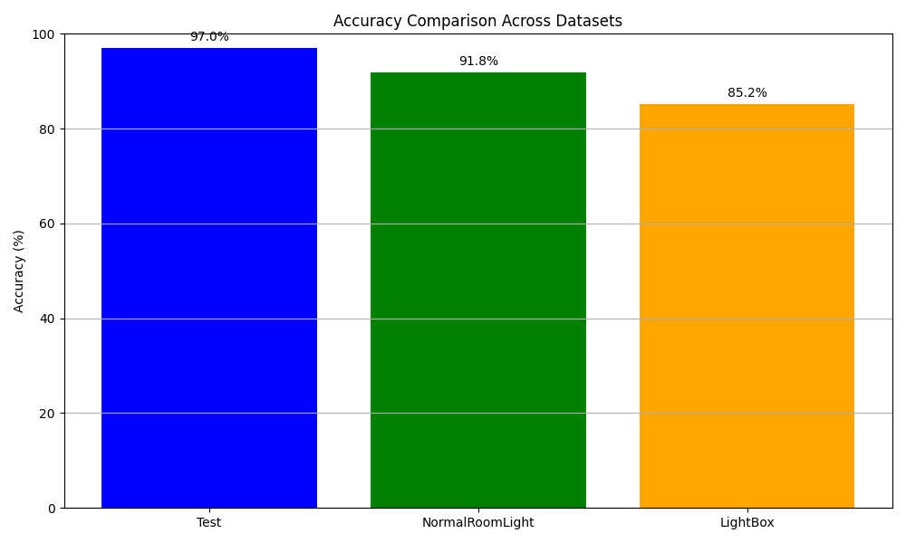
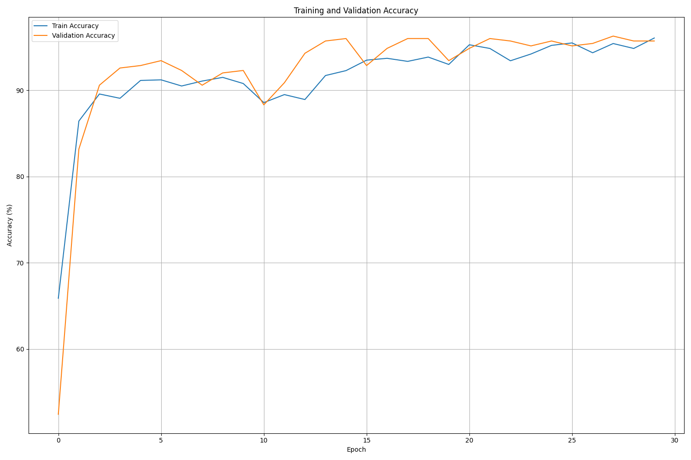
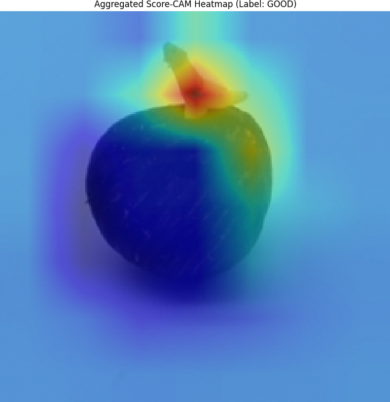
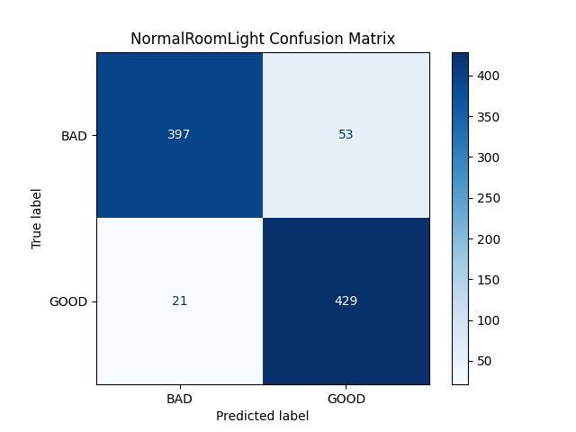

# CLIP Seed Quality Classifier

## Project Description
This project involves fine-tuning OpenAI's CLIP model on a dataset of oil palm seeds to classify them as healthy or unhealthy.

## CLIP Model Overview
CLIP is a vision-language model (VLM) developed by OpenAI that learns from both images and text. We fine-tune CLIP on images of germinated oil palm seeds paired with short textual descriptions, enabling it to distinguish between the two seed classes.

## Training Process
The model is trained on one dataset and evaluated on three separate datasets captured under different lighting conditions, testing the model's generalizability and resistance to overfitting.

## Model Configuration
Textual descriptions used during training are defined in config.py. This file also controls key hyperparameters such as the number of epochs and learning rate.

## Results
The fine-tuned model achieved 97% accuracy on the test dataset and maintained strong performance across unseen lighting conditions — 91.8% under normal room light and 85.2% in lightbox conditions — demonstrating good generalizability.

## Tech Stack
Python, PyTorch, OpenAI CLIP, scikit-learn, Matplotlib